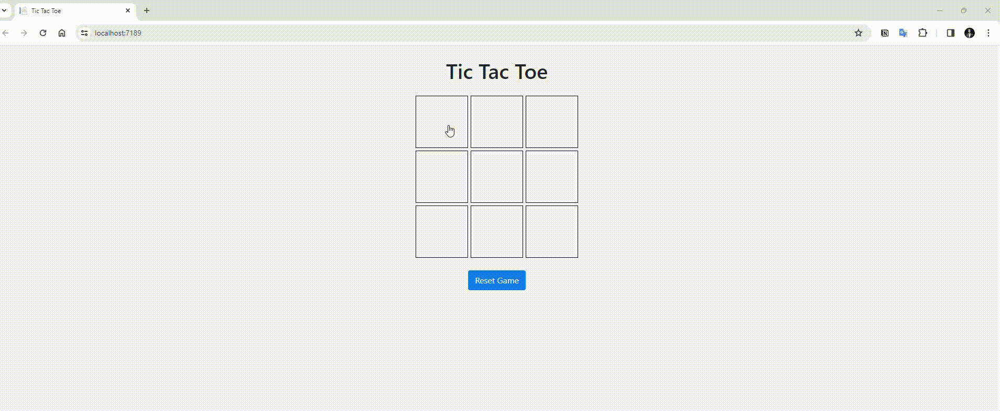

# Tic Tac Toe Game with SignalR
This project implements a real-time Tic Tac Toe game using SignalR for WebSocket communication between clients and the server. Players can take turns marking X or O on a 3x3 grid, and the game notifies players of moves, winners, draws, and resets.

## Demo
<p align="center"></p>

## Technologies Used

- **SignalR**: Real-time web functionality for bi-directional communication between client and server.
- **JavaScript**: Client-side scripting for handling game logic and UI interactions.
- **Bootstrap**: Front-end framework for styling and responsive design.
- **ASP.NET Core**: Server-side framework used to host the SignalR hub and manage game state.

## Features

- Real-time updates for moves, wins, draws, and game resets.
- Responsive UI using Bootstrap grid for optimal display on different devices.
- Modal dialogs to announce game results (win, draw) and options to play again or exit.

## Setup Instructions

1. **Clone the Repository**:
   ```
   git clone https://github.com/nies14/TicTacToe
   cd repository-name
   ```
2. **Restore Packages**:
    Ensure .NET Core SDK and npm are installed.
    ```
    dotnet restore
    ```
3. **Run the Application**:
   Start the ASP.NET Core server.
   ```
    dotnet run
   ```